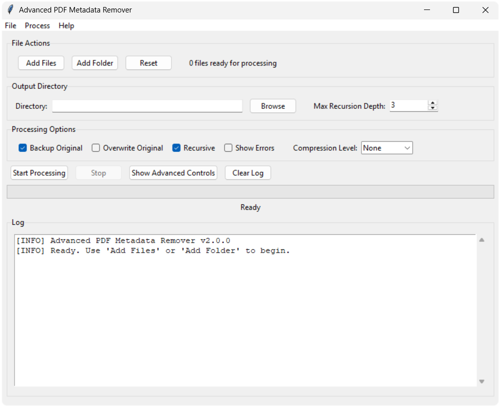
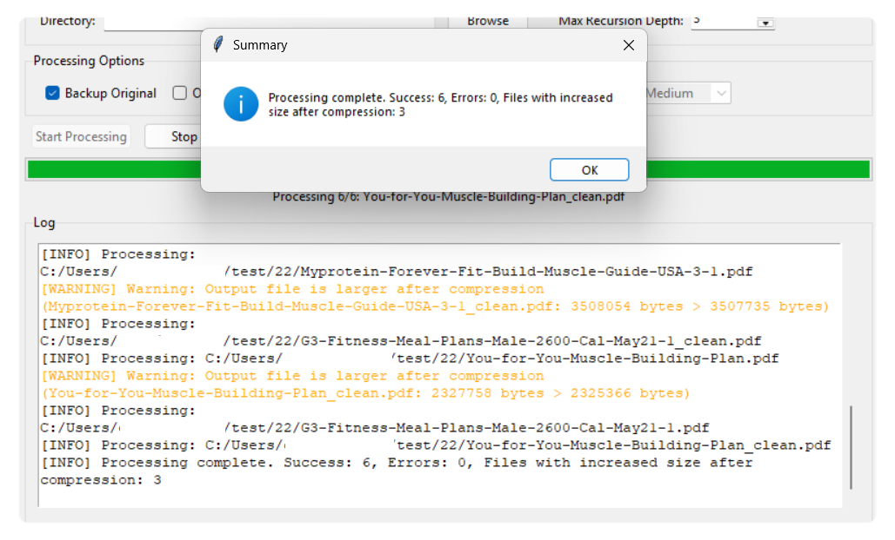
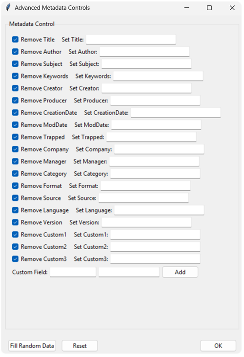

# 🧹 Advanced PDF Metadata Remover

A modern, user-friendly tool for removing and editing PDF metadata, with batch processing, advanced controls, and optional QPDF-based compression. Features both a powerful GUI and CLI.

---

## ✨ Features

- Remove or edit PDF metadata (standard and custom fields)
- Batch processing of files and folders (with recursion and depth control)
- QPDF-based compression (auto-downloads QPDF if needed)
- Modern Tkinter GUI with comprehensive reset functionality
- Simplified interface with button-based file selection (no drag & drop dependencies)
- Real-time logs, progress bar, and summary dialog
- Backup and overwrite options
- Cross-platform: Windows, macOS, Linux

---

## 🖼️ Screenshots

<details>
<summary><strong>📸 Click to show/hide screenshots</strong></summary>

### Main Window



### Processing Log



### Advanced Controls



</details>

---

## 🗂️ Project Structure

```text
advanced-pdf_metadata_remover/
├── LICENSE                # Project license (MIT + QPDF attribution)
├── Readme.md              # Project documentation and usage
├── requirements.txt       # Python dependencies
├── main.py                # Main entry point (GUI or CLI)
├── bin/                   # QPDF and related binaries for PDF compression
│   ├── qpdf.exe
│   ├── qpdf30.dll
│   ├── fix-qdf.exe
│   └── ...                # Other required DLLs and binaries
└── src/
    ├── gui.py             # All Tkinter GUI logic
    ├── processing.py      # PDF and metadata processing logic
    ├── utils.py           # Config and helper functions

```

---

## 🛠️ Installation & Development

### Quick Start

1. **Clone the repository:**
   ```sh
   git clone https://github.com/HelllGuest/advanced-pdf_metadata_remover.git
   cd advanced-pdf_metadata_remover
   ```
2. **(Recommended) Create a virtual environment:**
   ```sh
   python -m venv .venv
   # On Windows:
   .venv\Scripts\activate
   # On macOS/Linux:
   source .venv/bin/activate
   ```
3. **Install dependencies:**
   ```sh
   pip install -r requirements.txt
   ```

---

## 🚀 Usage

### 🖥️ Launch the GUI

```sh
python main.py
```

### 🖥️ CLI Mode

Process PDFs from the command line:
```sh
python main.py --cli input1.pdf input2.pdf --output outdir/ --recursive --compression Medium --remove-meta /Author /Title
```

#### CLI Features
- Batch/folder/recursive processing
- Metadata control: `--remove-meta`, `--edit-meta`, `--custom-meta`
- Compression: `--compression` (requires QPDF)
- Output, backup, overwrite options
- Full summary after processing

---

## 🖱️ GUI Instructions

1. **Add Files or Folders**: Use the buttons to select files or folders.
2. **Set Output Directory** and (optionally) max recursion depth.
3. **Choose Processing Options**: Backup, overwrite, recursive, show errors, compression.
4. **Start Processing**: Click 'Start Processing'.
5. **Advanced Controls**: Click 'Show Advanced Controls' for metadata editing/removal.
6. **Reset Everything**: Click 'Reset' to clear all files and reset all settings to defaults.
7. **View Log**: See real-time info, warnings, and errors. Use 'Clear Log' as needed.
8. **Menu Bar & Shortcuts**: Use File, Process, Help menus and keyboard shortcuts for all actions.

---

## 🛠️ Troubleshooting

| Problem                                 | Solution                                                                         |
| --------------------------------------- | -------------------------------------------------------------------------------- |
| QPDF missing or not found               | The app will prompt to download QPDF automatically if compression is selected.   |
| GUI doesn't start                       | Make sure you're using Python 3.7+ and have all requirements installed           |
| Files are not being processed           | Ensure selected files are valid PDFs and not in use by other applications        |
| Metadata still present after processing | Try opening PDF in another viewer; some readers cache metadata                   |
| Config file warning                     | The app will use defaults if config is corrupt or missing                        |
| Settings seem wrong                     | Use the 'Reset' button to return all settings to their default values            |
| ModuleNotFoundError: No module named 'pikepdf' | Install dependencies: `pip install -r requirements.txt` or create virtual environment |
| pip not found                          | Install pip: `sudo pacman -S python-pip` (Arch) or `sudo apt install python3-pip` (Ubuntu) |
| Externally managed environment error    | Create virtual environment: `python -m venv .venv && source .venv/bin/activate` |
| Fish shell activation error             | Use fish-specific activation: `source .venv/bin/activate.fish` |

---

## 🧩 Compatibility

### Python Version
- **Recommended:** Python 3.7 or higher
- **Minimum:** Python 3.7
- Uses f-strings, pathlib, and subprocess features from Python 3.7+

### Operating System
- **Windows:** Fully supported
- **macOS:** Fully supported
- **Linux:** Supported (install Tkinter with `sudo apt-get install python3-tk`)


## 🙏 Credits & Acknowledgments

- **QPDF**: PDF compression and optimization ([QPDF](https://github.com/qpdf/qpdf))
- **pikepdf**: PDF manipulation ([pikepdf](https://github.com/pikepdf/pikepdf))

- **Anoop Kumar**: Project author and maintainer ([GitHub](https://github.com/HelllGuest))
- **All contributors**: Thank you for your help and feedback!

---

## 📝 License

This project is licensed under the MIT License - see the [LICENSE](LICENSE) file for details.

**QPDF** is used for PDF compression and is licensed under the Apache License 2.0. Copyright © qpdf authors. All rights reserved.

---

## ℹ️ QPDF: PDF Optimizations: Tagged PDF
When compressing or optimizing PDFs, you may see a message like:
```
PDF Optimizations: Tagged PDF
```
This is an **informational message from QPDF** indicating that the PDF contains accessibility or structure tags ("tagged PDF"). It does **not** mean there was an error. The output PDF is still valid and compressed. If you rely on accessibility features, you may want to check that the tags are preserved as expected.

For more details, see the [QPDF documentation](https://qpdf.readthedocs.io/en/latest/).
